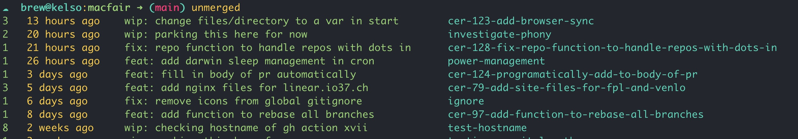
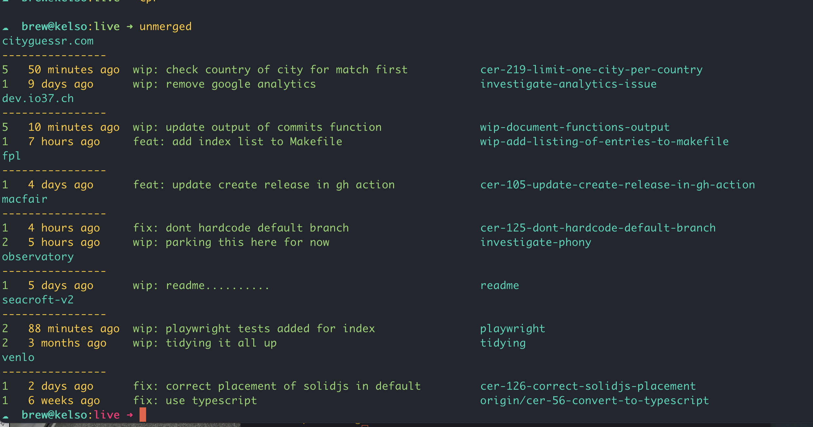

# Improving display of unnmerged commits

The purpose of the `unmerged` function is to show only unmerged commits from all branches. Lets take a look at the output, and then delve into the code.

## Output



When the function is run from inside a repo it will return

- the number of unmerged commits
- how long ago the last commit was
- the commit message of the last commit
- the name of its branch



When the function is run from outside a repo it will check for repos in the current directory, and return the name of the repo and the same information as in the previous instance, but limited to the last two unmerged commits per repo.

## Code

Lets take a look at the code. We're look at the main `unmerged` function initially, and then the two helper functions it uses.

### 1) unmerged

```bash
unmerged () { # List unmerged commits # ➜ unmerged 5
  if [ ! -d .git ]; then
    _unmerged_commits_across_repos
    return
  fi
  local default=$(_default_branch)
  [[ $1 ]] && no=$1 || no=500 # List most recent unmerged commit in each branch
  for branch in $(git branch --sort=-authordate | tr -d "* " | grep -v "^$default$"); do
    if [ -n "$(git log $default..$branch)" ]; then
      no=$(git rev-list --count $default..$branch)
      date=$(git log -1 $branch --pretty=format:"%ar" --no-walk)
      message=$(git log -1 $branch --pretty=format:"%s" --no-walk)
      printf "$no $date $message $branch\n"
    fi
  done | head -$no | awk '{first = $1; date = $2 " " $3 " " $4; last = $NF; message = substr($0, length($1 $2 $3 $4) + 5, length($0) - length($1 $2 $3 $4 $NF) - 5); printf "\033[0;32m%-3s \033[1;0m%-15s \033[0;32m%-52s \033[0;36m%s\n", first, date, message, last}'
}
```

Lets break down the above function step by step.

1. **Check if the current directory is a git repository**:

   ```bash
   if [ ! -d .git ]
   then
       _unmerged_commits_across_repos
       return
   fi
   ```

   If the current directory is not a git repository (i.e., it doesn't have a `.git` directory), it calls the helper function `_unmerged_commits_across_repos` and then exits.

2. **Determine the default branch**:

   ```bash
   local default=$(_default_branch)
   ```

   This calls the helper function `_default_branch` to determine the default branch of the repository.

3. **Determine the number of branches to display**:

   ```bash
   [[ -n $1 ]] && no=$1 || no=500
   ```

   If the function is called with an argument (e.g., `unmerged 10`), it will use that number to limit the number of branches displayed. If not, it defaults to showing 500 branches, effectively showing all unmerged branches

4. **Loop through each branch**:

   ```bash
   for branch in $(git branch --sort=-authordate | tr -d "* " | grep -v "^$default$")
     if [ -n "$(git log $default..$branch)" ]
   ```

   This loop goes through each branch in the repository, sorted by the author date in descending order. It excludes the default branch, and checks if there are any commits in the branch that are not in the default branch.

5. **Check if the branch has unmerged commits**:

   ```bash
   if [ -n "$(git log $default..$branch)" ]
   ```

   This checks if there are any commits in the branch that are not in the default branch.

6. **Get the number of unmerged commits, the date of the last commit, and its message**:

   ```bash
   no=$(git rev-list --count $default..$branch)
   date=$(git log -1 $branch --pretty=format:"%ar" --no-walk)
   message=$(git log -1 $branch --pretty=format:"%s" --no-walk)
   printf "$no $date $message $branch\n"
   ```

   This prints the number of unmerged commits, the date of the last commit, its message, and the branch name.

7. **Format and color the output**:
   The `awk` command at the end of the function is used to format the output and add some color to it. The output will show the number of unmerged commits in green, the date in default color, the commit message in green, and the branch name in cyan.

### 2) \_unmerged_commits_across_repos

```bash
_unmerged_commits_across_repos () {
  for i in */; do
    if [ -d "$i".git ]; then
      (
        cd "$i"
        local output=$(unmerged 2)
        if [[ -n "$output" ]]; then
          local repo_name=$(basename $(git rev-parse --show-toplevel))
          echo '\e[36m'$repo_name
          echo "----------------"
          echo $output
        fi
      )
    fi
  done
}
```

Lets break down the above function step by step.

1. **Loop through directorie and check if it contains a git repository**:

   ```bash
   for i in */
     if [ -d "$i".git ]
   ```

   This loop iterates over all directories in the current directory.

2. **Change to the directory and check for unmerged commits**:

   ```bash
   (
       cd "$i"
       local output=$(unmerged 2)
       ...
   )
   ```

   The code inside the parentheses runs in a subshell, which means it won't affect the current shell's environment. The script changes to the directory `$i` and then calls the `unmerged` to check for the 2 most recent unmerged commits.

3. **If there are unmerged commits, print the repository name and the commits**:

   ```bash
   if [[ -n "$output" ]]
   then
       local repo_name=$(basename $(git rev-parse --show-toplevel))
       echo '\e[36m'$repo_name
       echo "----------------"
       echo $output
   fi
   ```

   If the `unmerged` function returns any output (indicating there are unmerged commits), the script gets the name of the repository using `git rev-parse --show-toplevel` and then prints the repository name in cyan, followed by a separator, and the output from the `unmerged` function.

### 3) \_default_branch

```branches
_default_branch () {
	if [ ! -f .git/refs/remotes/origin/HEAD ]
	then
		local branch="main"
	else
		local branch=$(git symbolic-ref refs/remotes/origin/HEAD | sed 's@^refs/remotes/origin/@@')
	fi
	echo $branch
}
```

This function determines the default branch of the repository. It checks if the file `.git/refs/remotes/origin/HEAD` exists. If it does, it uses the contents of that file to determine the default branch. If not, it defaults to `main`.
